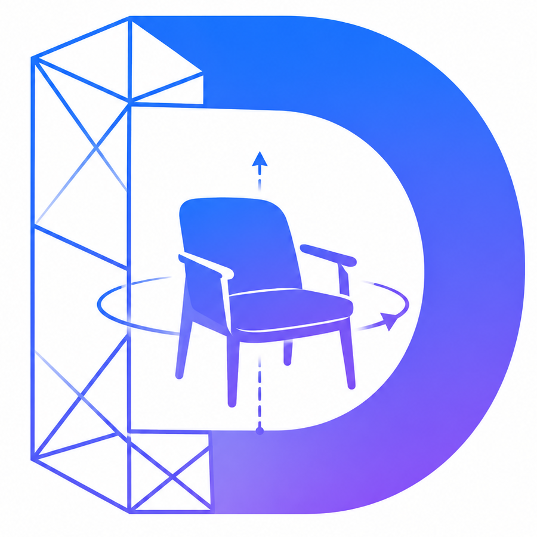
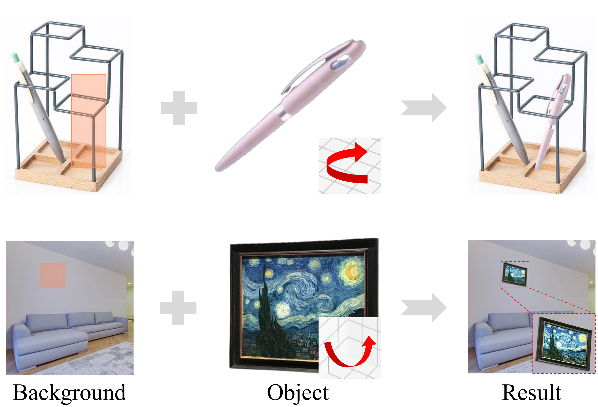
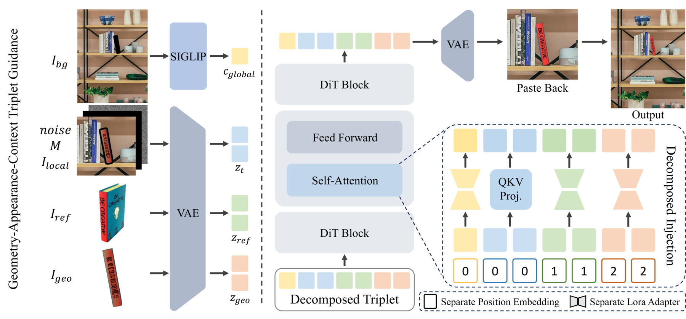
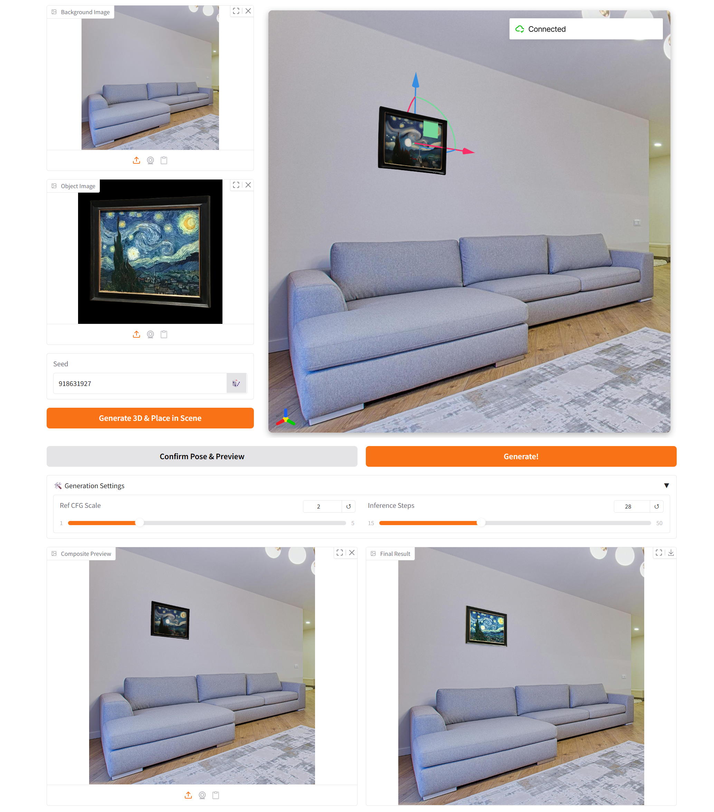

<div align="center">
<div style="text-align: center;">
    
    <h2>Direct 3D-Aware Object Insertion via Decomposed Visual Proxies</h2>
    <h3>🔥 ICML 2026</h3>
</div>

<div>
    <a href="https://scholar.google.com/citations?view_op=list_works&hl=en&user=ykDY1vsAAAAJ" target="_blank">Jingbo Gong</a><sup>1,3</sup>&emsp;
    <a href="https://yikai-wang.github.io/" target="_blank">Yikai Wang</a><sup>2✉</sup>&emsp;
    <a href="https://nirvanalan.github.io/" target="_blank">Yushi Lan</a><sup>2</sup>&emsp;
    <a href="https://scholar.google.com/citations?user=kKyVqq0AAAAJ" target="_blank">Yuhao Wan</a><sup>1</sup>&emsp;
    <a href="https://github.com/ouyangziheng" target="_blank">Ziheng Ouyang</a><sup>1</sup>&emsp;
    <br>
    <a href="https://zhaorui.xyz/" target="_blank">Rui Zhao</a><sup>4</sup>&emsp;
    <a href="https://mmcheng.net/cmm/" target="_blank">Ming-Ming Cheng</a><sup>1,5✉</sup>&emsp;
    <a href="https://houqb.github.io/" target="_blank">Qibin Hou</a><sup>1</sup>&emsp;
    <a href="https://www.mmlab-ntu.com/person/ccloy/" target="_blank">Chen Change Loy</a><sup>2</sup>
</div>

<div>
    <sup>1</sup>VCIP, NKU&emsp;
    <sup>2</sup>S-Lab, NTU&emsp;
    <sup>3</sup>ZGCA&emsp;
    <sup>4</sup>SenseTime Research&emsp;
    <sup>5</sup>NKIARI, Shenzhen Futian
</div>

<div>
    <h4 align="center">
        <a href="https://gong1130.github.io/DIRECT/" target="_blank">
            
        </a>
        <a href="https://arxiv.org/pdf/2606.06601" target="_blank">
            
        </a>
        <a href="https://arxiv.org/abs/2606.06601" target="_blank">
            
        </a>
        <a href="https://huggingface.co/superGong/DIRECT" target="_blank">
            
        </a>
        <a href="https://huggingface.co/datasets/superGong/DIRECT-dataset" target="_blank">
            
        </a>
    </h4>
</div>

<strong>DIRECT enables pose-controllable object insertion with explicit geometric guidance from a reconstructed 3D proxy.</strong>

<p align="center">
  
</p>

For more visual results, please check out our <a href="https://gong1130.github.io/DIRECT/" target="_blank">project page</a>.

---
</div>

## 📬 News

- [2026.07] Release training dataset, training code, and preprocessing code.
- [2026.06] Release inference code, interactive demo, and model weights.
- [2026.05] DIRECT was accepted by ICML 2026! The repository and project page are now available.

## 📅 TODO

- [x] Release inference code and interactive demo.
- [x] Release dataset.
- [x] Release training and preprocessing code.

## 🔍 Overview

<p align="center">
  
</p>

## 🔧 Installation

The environment is tested with Python 3.10.18, PyTorch 2.4.0, and CUDA 11.8.

```bash
git clone https://github.com/Gong1130/DIRECT.git
cd DIRECT

conda create -n direct python=3.10.18 -y
conda activate direct
```

Install PyTorch for CUDA 11.8:

```bash
pip install torch==2.4.0+cu118 torchvision==0.19.0+cu118 --index-url https://download.pytorch.org/whl/cu118
```

Install the remaining dependencies:

```bash
pip install --no-build-isolation -r requirements.txt
pip install -e .
```

Some dependencies are compiled CUDA extensions. If the build cannot find CUDA, set `CUDA_HOME` to your local CUDA 11.8 toolkit path before installing the requirements.


## 🪄 Interactive Demo

Run the demo with:

```bash
python demo/demo.py --gradio_port 7860 --viser_port 8081
```

> On the first run, the demo will automatically download [DIRECT](https://huggingface.co/superGong/DIRECT), [FLUX.1-Fill-dev](https://huggingface.co/black-forest-labs/FLUX.1-Fill-dev), [TRELLIS-image-large](https://huggingface.co/microsoft/TRELLIS-image-large), [SigLIP2](https://huggingface.co/google/siglip2-so400m-patch14-384), and [RMBG-2.0](https://huggingface.co/briaai/RMBG-2.0) from Hugging Face. [FLUX.1-Fill-dev](https://huggingface.co/black-forest-labs/FLUX.1-Fill-dev) and [RMBG-2.0](https://huggingface.co/briaai/RMBG-2.0) are gated models, so please accept their licenses and authenticate with `huggingface-cli login` or by setting your `HF_TOKEN` before running the demo.

Open the Gradio interface at `http://localhost:7860`. The Viser 3D viewer runs on `http://localhost:8081` and is embedded inside the Gradio page.
After launching the demo, an interactive interface will appear as follows.

<p align="center">
  
</p>

If you run the demo on a remote server, forward both ports:

```bash
ssh -L 7860:localhost:7860 -L 8081:localhost:8081 <user>@<server>
```

After port forwarding, open `http://localhost:7860` in your local browser to use the full demo.

## 📦 Dataset Download

DIRECT training uses the released DIRECT dataset and the mask templates from MISATO for *Shape-Decomposed Mask Augmentation*, described in Section 3.4 of our [paper](https://arxiv.org/pdf/2606.06601).

Download and extract the DIRECT dataset:

- https://huggingface.co/datasets/superGong/DIRECT-dataset

```bash
cd <path-to-DIRECT-dataset>

for t in MVImgNet/*.tar; do
  tar -xf "$t" -C MVImgNet
  rm "$t"
done

for t in SA1B/*.tar; do
  tar -xf "$t" -C SA1B
  rm "$t"
done
```

Download MISATO and keep only the object mask templates used by DIRECT:

- https://huggingface.co/datasets/yikaiwang/MISATO

```bash
cd <path-to-MISATO>

unzip asuka_training_mask.zip \
  'asuka_training_mask/object_masks/*' \
  -x 'asuka_training_mask/object_masks/humanparsing_masks/*'

find . -mindepth 1 -maxdepth 1 ! -name 'asuka_training_mask' -exec rm -rf {} +
```

After downloading the datasets, update `dataset_root` and `mask_template_path` in `dataset_config/direct_stage1_512.yaml` and `dataset_config/direct_stage2_1024.yaml` to match your local paths.

## 🏋️ Training

We train DIRECT with Accelerate. Training is divided into two stages.

Stage 1 trains at 512 resolution:

```bash
bash training/train_direct_stage1.sh
```

Stage 2 trains at 1024 resolution and initializes from the Stage 1 checkpoint:

```bash
bash training/train_direct_stage2.sh
```

In our experiments, we train Stage 1 with 4 GPUs and Stage 2 with 8 GPUs.

## 🧩 Preprocess

We provide example preprocessing code for *Geometric Alignment*, described in Section 3.4 of our [paper](https://arxiv.org/pdf/2606.06601).

Given an object image, *Geometric Alignment* estimates its 6D pose in the TRELLIS-generated 3D object. This pipeline can be used as a reference for preparing DIRECT training data on other datasets.

Please see [preprocess](./preprocess/) for details.

## 📝 BibTeX

If you find DIRECT useful for your research, please consider citing our paper:

```bibtex
@inproceedings{gong2026direct,
  title     = {Direct 3D-Aware Object Insertion via Decomposed Visual Proxies},
  author    = {Jingbo Gong and Yikai Wang and Yushi Lan and Yuhao Wan and Ziheng Ouyang and Rui Zhao and Ming-Ming Cheng and Qibin Hou and Chen Change Loy},
  booktitle = {ICML},
  year      = {2026}
}
```

## 👏 Acknowledgements

This codebase builds on [TRELLIS](https://github.com/microsoft/TRELLIS), [FLUX](https://github.com/black-forest-labs/flux), [EasyControl](https://github.com/Xiaojiu-z/EasyControl), and the Hugging Face Diffusers ecosystem.

## ✉️ Contact

If you have any questions, please feel free to contact us at jingbogong@mail.nankai.edu.cn. We are also actively improving DIRECT, and we welcome any failure cases or feedback encountered during use!
